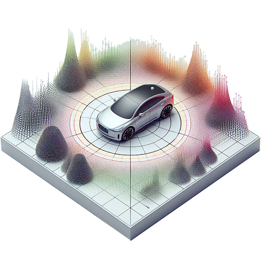
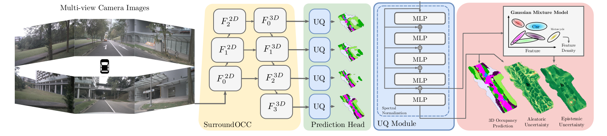
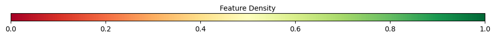
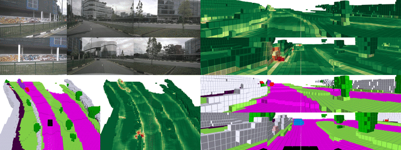
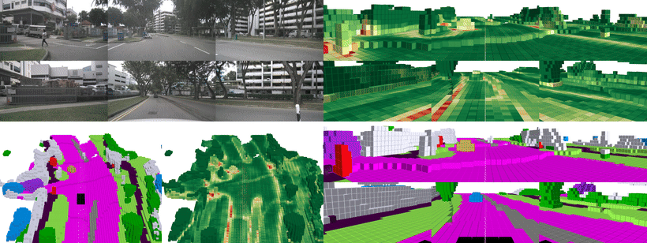
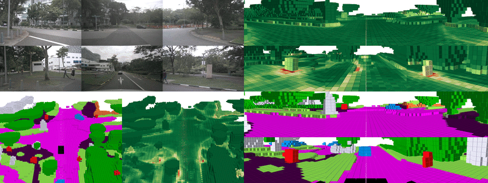

<p align="center">
  
  
  <h3 align="center"><strong>OCCUQ: Exploring Efficient Uncertainty Quantification for 3D Occupancy Prediction</strong></h3>

  <p align="center">
      <a href="https://github.com/SeverinHeidrich" target='_blank'>Severin Heidrich*</a><sup>1</sup>&nbsp;&nbsp;
      <a href="https://github.com/TillBeemelmanns" target='_blank'>Till Beemelmanns*</a><sup>1</sup>&nbsp;&nbsp;
      <a href="https://github.com/kumuji" target='_blank'>Alexey Nekrasov*</a><sup>2</sup>&nbsp;&nbsp;
      <a href="https://www.vision.rwth-aachen.de/" target='_blank'>Bastian Leibe</a><sup>2</sup>&nbsp;&nbsp;
      <a href="https://www.ika.rwth-aachen.de/de/institut/team/univ-prof-dr-ing-lutz-eckstein.html" target='_blank'>Lutz Eckstein</a><sup>1</sup>&nbsp;&nbsp;
    <br>
    <small><sup>1</sup>Institute for Automotive Engineering, RWTH Aachen University, Germany&nbsp;&nbsp;</small>
    <br>
    <small><sup>2</sup>Computer Vision Institute, RWTH Aachen University, Germany&nbsp;&nbsp;</small>
    <br>
    <small>*Denotes equal contribution</small>
  </p>
</p>

> **Abstract:** Autonomous driving has the potential to significantly enhance productivity and provide numerous societal benefits. Ensuring robustness in these safety-critical systems is essential, particularly when vehicles must navigate adverse weather conditions and sensor corruptions that may not have been encountered during training. Current methods often overlook uncertainties arising from adversarial conditions or distributional shifts, limiting their real-world applicability. We propose an efficient adaptation of an uncertainty estimation technique for 3D occupancy prediction. Our method dynamically calibrates model confidence using epistemic uncertainty estimates. Our evaluation under various camera corruption scenarios, such as fog or missing cameras, demonstrates that our approach effectively quantifies epistemic uncertainty by assigning higher uncertainty values to unseen data. We introduce region-specific corruptions to simulate defects affecting only a single camera and validate our findings through both scene-level and region-level assessments. Our results show superior performance in Out-of-Distribution (OoD) detection and confidence calibration compared to common baselines such as Deep Ensembles and MC-Dropout. Our approach consistently demonstrates reliable uncertainty measures, indicating its potential for enhancing the robustness of autonomous driving systems in real-world scenarios.

-------------------------------

<!-- omit in toc -->
### [Paper](https://arxiv.org/abs/2503.10605) | [Video](https://youtu.be/yVDy-lHESY0) | [Dataset](https://huggingface.co/datasets/TillBeemelmanns/MultiCorrupt/tree/main)


<!-- omit in toc -->
### Outline
- [News](#news)
- [Introduction](#introduction)
- [Method](#method)
- [Demo](#demo)
- [Getting Started](#getting-started)
- [Quick Start](#quick-start)
  - [1. Fit GMM](#1-fit-gmm)
  - [2. Inference](#2-inference)
  - [3. OOD Detection](#3-ood-detection)
  - [4. Generate Video](#4-generate-video)
- [TODOs](#todos)
- [Acknowledgement](#acknowledgement)
- [Citation](#citation)


## News
- [01/31/2025] OCCUQ is accepted to ICRA2025.

## Introduction
Current autonomous driving methods use multi-camera setups to construct
3D occupancy maps, which consist of voxels representing space occupancy and
different semantic classes, serving as input for trajectory planning and
collision avoidance.  While many approaches focus on dataset generation and
model architecture improvements for 3D occupancy prediction, they often
overlook uncertainties arising from adversarial conditions or distributional
shifts, hindering real-world deployment.

In our work, we focus on the adaptation of an efficient uncertainty estimation
method for 3D occupancy prediction. By incorporating an uncertainty module in
the dense 3D occupancy detection head and separately training a 
Gaussian Mixture Model (GMM) at the feature level, we aim to disentangle
aleatoric and epistemic uncertainty during inference.


## Method 

From multi-view camera images, our method provides 3D occupancy predictions with
reliable epistemic and aleatoric uncertainties on a voxel level. We build on
top of SurroundOCC, and introduce an additional Uncertainty Quantification (UQ)
module into the prediction head.


## Demo  

<!-- omit in toc -->
---------------------------------------

<!-- omit in toc -->
---------------------------------------

<!-- omit in toc -->
---------------------------------------



## Getting Started
- [Installation](docs/install.md) 
- [Prepare Dataset](docs/data.md)
- [Train, Eval and Visualize](docs/run.md)


## Quick Start


### 1. Fit GMM
Download the [trained model](https://rwth-aachen.sciebo.de/s/2o1LOb4PwFbPzSb)
and fit the Gaussian Mixture Model (GMM) for uncertainty estimation. Run
`gmm_fit.py` with the following command:


```bash
export CUDA_VISIBLE_DEVICES=0
export PYTHONPATH=$PYTHONPATH:/workspace

config=/workspace/projects/configs/occuq/occuq_mlpv5_sn.py
weight=/workspace/work_dirs/occuq_mlpv5_sn/epoch_6.pth

python tools/gmm_fit.py \
$config \
$weight \
--eval bbox
```


### 2. Inference
Once the GMM is fitted, you can run inference of the model with GMM Uncertainty
Quantification using the following command:

```bash
python tools/gmm_evaluate.py \
$config \
$weight \
--eval bbox
```


### 3. OOD Detection
To generate the **OOD detection** results as in the paper for OCCUQ, you 
can check out the [gmm_multicorrupt_evaluate.sh](scripts/gmm_multicorrupt_evaluate.sh)
script where we perform step 1. and 2. and then iterate over the corruptions
`snow`, `fog`, `motionblur`, `brightness` and `missingcamera`, each with severity
levels `1`, `2` and `3`. Then, we evaluate the OOD detection performance using
[scripts/ood_detection_evaluation.py](scripts/ood_detection_evaluation.py).

<!-- omit in toc -->
#### Resolution 200x200x16 (Scale 3)
| Measure           | mAUROC ⬆️  | mAUPR ⬆️ | mFPR95 ⬇️ |
|-------------------|------------|----------|-----------|
| Softmax Entropy   | 54.63      | 56.21    | 94.47     |
| Max. Softmax      | 56.16      | 57.52    | 93.17     |
| GMM (Ours)        | 80.15      | 79.43    | 56.18     |

Note: After refactoring the code and retraining the GMM, we obtained slight
different results compared to the values reported in our paper.


### 4. Generate Video
For video generation, run the following command:

```bash
python tools/gmm_video.py \
$config \
$weight \
--eval bbox
```

We generated voxel visualizations as in the videos with
[Mayavi](https://github.com/enthought/mayavi). More instructions will follow soon.


## TODOs
- [x] Upload MultiCorrupt dataset for evaluation
- [X] Add scripts for OOD detection
- [ ] Explain which corruptions were used
- [ ] Explain GMM GPU inference
- [ ] Add scripts for Region OOD Detection
- [ ] Add Monte Carlo Dropout and Deep Ensembles
- [ ] Add Uncertainty Guided Temperature Scaling (UGTS)


## Acknowledgement
Many thanks to these excellent projects ❤️
- [SurroundOCC](https://github.com/weiyithu/SurroundOcc)
- [Deep Deterministic Uncertainty](https://github.com/omegafragger/DDU)
- [MultiCorrupt](https://github.com/ika-rwth-aachen/MultiCorrupt)
- [OpenMMLab](https://github.com/open-mmlab)

We thank the BMBF and EU for funding this project ❤️
> This work has received funding from the [European Union’s Horizon Europe Research and Innovation Programme](https://research-and-innovation.ec.europa.eu/funding/funding-opportunities/funding-programmes-and-open-calls/horizon-europe_en) under Grant Agreement No. 101076754 - [AIthena project](https://aithena.eu/). The project was partially funded by the [BMBF](https://www.bmbf.de/) project “WestAI” (grant no. 01IS22094D)


## Citation
If this work is helpful for your research, please consider citing this work:


```
@inproceedings{heidrich2025occuq,
 title={{OCCUQ: Exploring Efficient Uncertainty Quantification for 3D Occupancy Prediction}},
 author={Heidrich, Severin and Beemelmanns, Till and Nekrasov, Alexey and Leibe, Bastian and Eckstein, Lutz},
 booktitle="International Conference on Robotics and Automation (ICRA)",
 year={2025}
}
```

